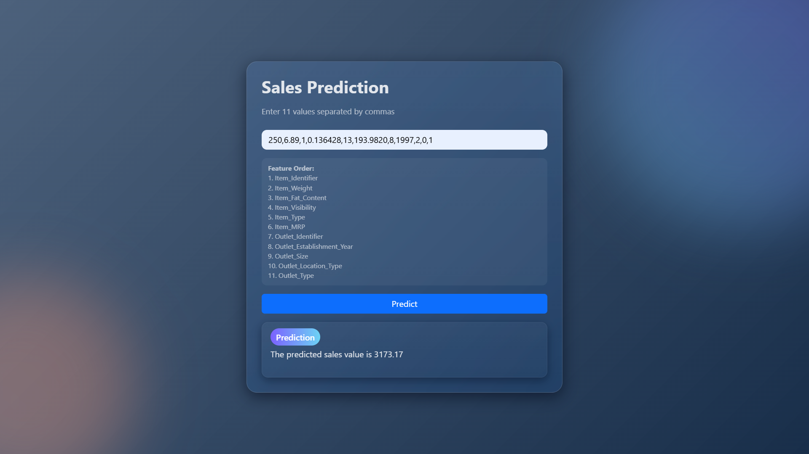

<div id="top"></div>

<div align="center">

# 🛒 SALES VISION
*A Retail Sales Prediction Web Application Using Machine Learning*


**Tech Stack Used**


</div>

---

## 📑 Table of Contents

- [Overview](#-overview)
- [Demo](#-demo)
- [Features](#-features)
- [Tech Stack](#-tech-stack)
- [Project Structure](#-project-structure)
- [Getting Started](#-getting-started)
- [Usage](#-usage)
- [Future Enhancements](#-future-enhancements)
- [Contact](#-contact)

---

## 🧐 Overview

**Sales Vision** is an end-to-end **ML-powered Sales Prediction Web App** built using **Flask** and an **XGBoost regression model**.  
Users can enter 11 product + store features and instantly receive predicted sales values.

The model is trained on **real-world retail dataset**, preprocessed using Scikit-learn pipelines, and deployed using **Render** for cloud access.

---

## 🔗 Demo

> Live Preview: https://sales-txer.onrender.com

---

## ✨ Features

✅ Predict sales using 11 input features  
✅ XGBoost model trained for high accuracy  
✅ Flask backend for serving predictions  
✅ Clean HTML + Bootstrap frontend  
✅ Modern glassmorphism UI design  
✅ Fully responsive – desktop & mobile  
✅ Real-time results with smooth UI transitions  

---

## ⚙️ Tech Stack

### **Frontend:**
- HTML5
- Bootstrap 5
- Custom CSS (Glassmorphism)
- JavaScript for form handling

### **Backend:**
- Python
- Flask
- NumPy, Pandas
- XGBoost + Scikit-learn
- Pickle (Model Serialization)

### **Deployment:**
- Render (Cloud Hosting)
- Gunicorn (Production Server)

---

## 📂 Project Structure

```bash
SalesVision/
├── templates/                 # Frontend HTML files
│   └── index.html
├── static/                    # CSS, images, assets
│   └── styles.css
├── app.py                     # Flask backend
├── happy.pkl                  # Trained ML model
├── requirements.txt           # Dependencies
└── README.md                  # Documentation
```


---

## 🚀 Getting Started

### ✅ Prerequisites

- Python 3.10+ installed
- pip installed

---

### 👇 Installation

```bash
# Clone the repository
git clone https://github.com/Surya821/Sales

# Navigate to the project
cd sales
```

### 🔧 Install Dependencies

``` bash
pip install -r requirements.txt
```

### 🖥️ Run Server

``` bash
python app.py
```

---

---

## ▶️ Usage

1. **Open the app in browser**
2. **Enter the 11 features in the input fields**
3. **Click Predict Sales**
4. **Get instant prediction with formatted result**

---

## 🚧 Future Enhancements

- 📊 Feature importance visualization  
- 📈 Interactive charts for predictions
- 🟦 CSV upload for batch predictions
- 🔒 API mode with key authentication
- 📱 Fully redesigned mobile UI

---

## 📬 Contact

**Created by — Surya Pratap Singh**  
📩 **Contact Me:**  
[LinkedIn](https://www.linkedin.com/in/surya-pratap-singh1/) • [Gmail](mailto:surya30082005@gmail.com) surya30082005@gmail.com

If you like this project, consider giving it a ⭐ on GitHub!

<p align="right">(<a href="#top">⬆️ Back to Top</a>)</p>
